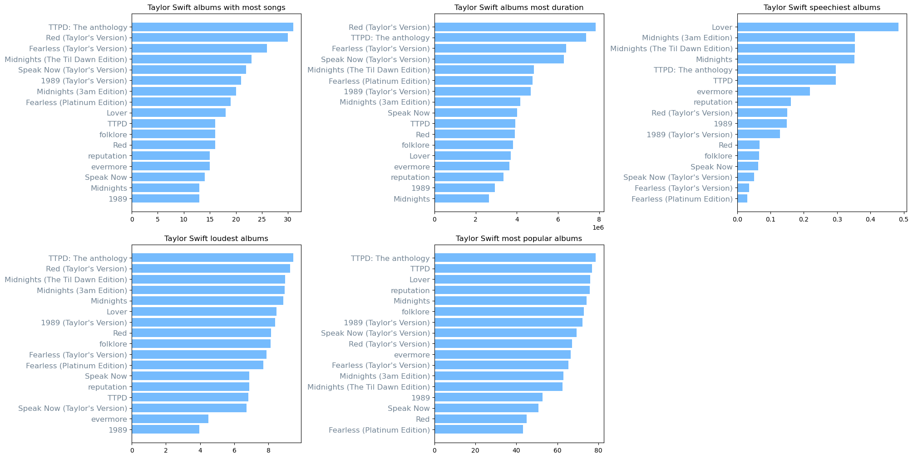
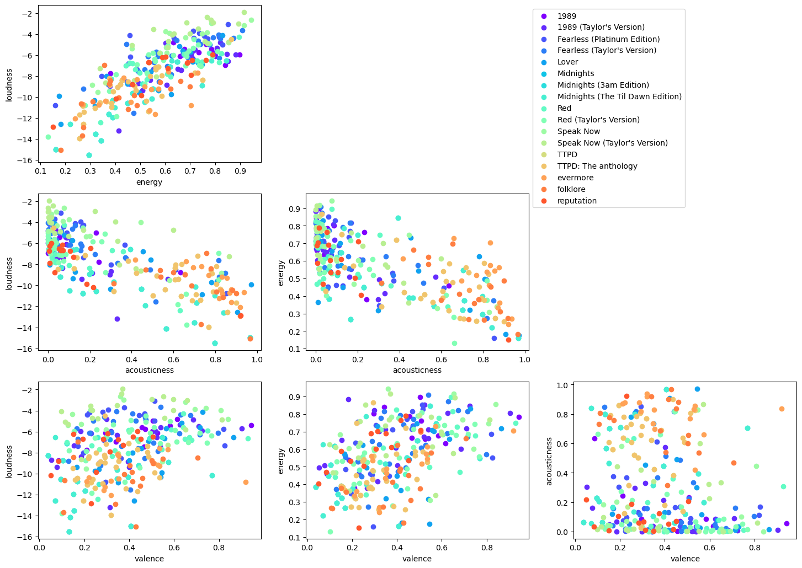
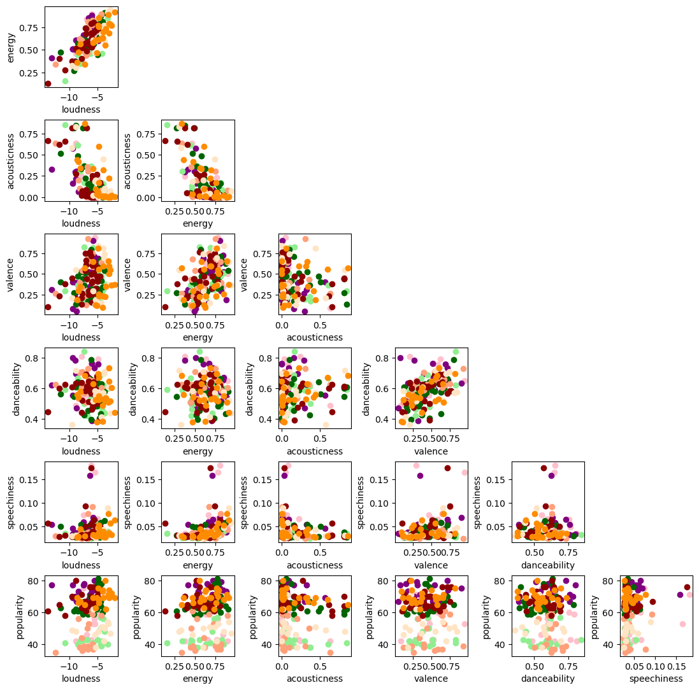

```python
# dataset from https://www.kaggle.com/datasets/arthurboari/taylor-swift-spotify-data
#df = pd.read_csv('Taylor Swift Spotify Data 07-23.csv')
# dataset from https://www.kaggle.com/datasets/jarredpriester/taylor-swift-spotify-dataset
import warnings
warnings.simplefilter(action='ignore', category=FutureWarning)

import pandas as pd
import matplotlib.pyplot as plt
import numpy as np
from sklearn.linear_model import LinearRegression
total_records = pd.read_csv('taylor_swift_spotify.csv')
```

## Basic dataframe understanding

Let us get the frameheader to check what is located inside. 


```python
total_records.head()
```


<div>
<style scoped>
    .dataframe tbody tr th:only-of-type {
        vertical-align: middle;
    }

    .dataframe tbody tr th {
        vertical-align: top;
    }

    .dataframe thead th {
        text-align: right;
    }
</style>
<table border="1" class="dataframe">
  <thead>
    <tr style="text-align: right;">
      <th></th>
      <th>Unnamed: 0</th>
      <th>name</th>
      <th>album</th>
      <th>release_date</th>
      <th>track_number</th>
      <th>id</th>
      <th>uri</th>
      <th>acousticness</th>
      <th>danceability</th>
      <th>energy</th>
      <th>instrumentalness</th>
      <th>liveness</th>
      <th>loudness</th>
      <th>speechiness</th>
      <th>tempo</th>
      <th>valence</th>
      <th>popularity</th>
      <th>duration_ms</th>
    </tr>
  </thead>
  <tbody>
    <tr>
      <th>0</th>
      <td>0</td>
      <td>Fortnight (feat. Post Malone)</td>
      <td>THE TORTURED POETS DEPARTMENT: THE ANTHOLOGY</td>
      <td>2024-04-19</td>
      <td>1</td>
      <td>6dODwocEuGzHAavXqTbwHv</td>
      <td>spotify:track:6dODwocEuGzHAavXqTbwHv</td>
      <td>0.5020</td>
      <td>0.504</td>
      <td>0.386</td>
      <td>0.000015</td>
      <td>0.0961</td>
      <td>-10.976</td>
      <td>0.0308</td>
      <td>192.004</td>
      <td>0.281</td>
      <td>82</td>
      <td>228965</td>
    </tr>
    <tr>
      <th>1</th>
      <td>1</td>
      <td>The Tortured Poets Department</td>
      <td>THE TORTURED POETS DEPARTMENT: THE ANTHOLOGY</td>
      <td>2024-04-19</td>
      <td>2</td>
      <td>4PdLaGZubp4lghChqp8erB</td>
      <td>spotify:track:4PdLaGZubp4lghChqp8erB</td>
      <td>0.0483</td>
      <td>0.604</td>
      <td>0.428</td>
      <td>0.000000</td>
      <td>0.1260</td>
      <td>-8.441</td>
      <td>0.0255</td>
      <td>110.259</td>
      <td>0.292</td>
      <td>79</td>
      <td>293048</td>
    </tr>
    <tr>
      <th>2</th>
      <td>2</td>
      <td>My Boy Only Breaks His Favorite Toys</td>
      <td>THE TORTURED POETS DEPARTMENT: THE ANTHOLOGY</td>
      <td>2024-04-19</td>
      <td>3</td>
      <td>7uGYWMwRy24dm7RUDDhUlD</td>
      <td>spotify:track:7uGYWMwRy24dm7RUDDhUlD</td>
      <td>0.1370</td>
      <td>0.596</td>
      <td>0.563</td>
      <td>0.000000</td>
      <td>0.3020</td>
      <td>-7.362</td>
      <td>0.0269</td>
      <td>97.073</td>
      <td>0.481</td>
      <td>80</td>
      <td>203801</td>
    </tr>
    <tr>
      <th>3</th>
      <td>3</td>
      <td>Down Bad</td>
      <td>THE TORTURED POETS DEPARTMENT: THE ANTHOLOGY</td>
      <td>2024-04-19</td>
      <td>4</td>
      <td>1kbEbBdEgQdQeLXCJh28pJ</td>
      <td>spotify:track:1kbEbBdEgQdQeLXCJh28pJ</td>
      <td>0.5600</td>
      <td>0.541</td>
      <td>0.366</td>
      <td>0.000001</td>
      <td>0.0946</td>
      <td>-10.412</td>
      <td>0.0748</td>
      <td>159.707</td>
      <td>0.168</td>
      <td>82</td>
      <td>261228</td>
    </tr>
    <tr>
      <th>4</th>
      <td>4</td>
      <td>So Long, London</td>
      <td>THE TORTURED POETS DEPARTMENT: THE ANTHOLOGY</td>
      <td>2024-04-19</td>
      <td>5</td>
      <td>7wAkQFShJ27V8362MqevQr</td>
      <td>spotify:track:7wAkQFShJ27V8362MqevQr</td>
      <td>0.7300</td>
      <td>0.423</td>
      <td>0.533</td>
      <td>0.002640</td>
      <td>0.0816</td>
      <td>-11.388</td>
      <td>0.3220</td>
      <td>160.218</td>
      <td>0.248</td>
      <td>80</td>
      <td>262974</td>
    </tr>
  </tbody>
</table>
</div>


Let us replace the capital lettered long album with smething small and readable. 


```python
total_records = total_records.replace('THE TORTURED POETS DEPARTMENT', 'TTPD', regex=True)
total_records = total_records.replace('THE ANTHOLOGY', 'The anthology', regex=True)
```

Filter unwanted albums to get the albums only. This involves the Big Machine versions and Taylor's versions. 


```python
# filter the rows that contain the substring, this is to remove entries which aren't original albums but special renditions and such
substring = ['Deluxe','Disney', 'Live','Stadium','delux','International','Piano']
pattern = '|'.join(substring)

filter = total_records['album'].str.contains(pattern) 
filtered_df = total_records[~filter]

print(filtered_df['album'].unique())
filtered_df.groupby(['album']).size().sum()
```

    ['TTPD: The anthology' 'TTPD' "1989 (Taylor's Version)"
     "Speak Now (Taylor's Version)" 'Midnights (The Til Dawn Edition)'
     'Midnights (3am Edition)' 'Midnights' "Red (Taylor's Version)"
     "Fearless (Taylor's Version)" 'evermore' 'folklore' 'Lover' 'reputation'
     '1989' 'Red' 'Speak Now' 'Fearless (Platinum Edition)']


    328


## Album summaries
This will be album summary. This should act as a one stop shop to quickly get an overview of what's happening for each album. 


```python
album_summary=pd.DataFrame()
album_summary['album']=filtered_df.groupby(['album'])['speechiness'].min().keys()
album_summary['size']=list(filtered_df.groupby(['album']).size())
album_summary['speechiness_min']=list(filtered_df.groupby(['album'])['speechiness'].min())
album_summary['speechiness_max']=list(filtered_df.groupby(['album'])['speechiness'].max())
album_summary['loudness_min']=list(filtered_df.groupby(['album'])['loudness'].min())
album_summary['loudness_max']=list(filtered_df.groupby(['album'])['loudness'].max())
album_summary['total_duration_ms']=list(filtered_df.groupby(['album'])['duration_ms'].sum())
album_summary['total_duration_HMS'] = pd.to_datetime(album_summary['total_duration_ms'], unit='ms').dt.strftime('%H:%M:%S:%f').str[:-3] 
album_summary['mean_popularity'] =  list(filtered_df.groupby(['album'])['popularity'].mean())
album_summary
```


<div>
<style scoped>
    .dataframe tbody tr th:only-of-type {
        vertical-align: middle;
    }

    .dataframe tbody tr th {
        vertical-align: top;
    }

    .dataframe thead th {
        text-align: right;
    }
</style>
<table border="1" class="dataframe">
  <thead>
    <tr style="text-align: right;">
      <th></th>
      <th>album</th>
      <th>size</th>
      <th>speechiness_min</th>
      <th>speechiness_max</th>
      <th>loudness_min</th>
      <th>loudness_max</th>
      <th>total_duration_ms</th>
      <th>total_duration_HMS</th>
      <th>mean_popularity</th>
    </tr>
  </thead>
  <tbody>
    <tr>
      <th>0</th>
      <td>1989</td>
      <td>13</td>
      <td>0.0324</td>
      <td>0.1810</td>
      <td>-8.768</td>
      <td>-4.807</td>
      <td>2927864</td>
      <td>00:48:47:864</td>
      <td>52.692308</td>
    </tr>
    <tr>
      <th>1</th>
      <td>1989 (Taylor's Version)</td>
      <td>21</td>
      <td>0.0303</td>
      <td>0.1590</td>
      <td>-13.187</td>
      <td>-4.803</td>
      <td>4678327</td>
      <td>01:17:58:327</td>
      <td>72.190476</td>
    </tr>
    <tr>
      <th>2</th>
      <td>Fearless (Platinum Edition)</td>
      <td>19</td>
      <td>0.0239</td>
      <td>0.0549</td>
      <td>-10.785</td>
      <td>-3.096</td>
      <td>4766608</td>
      <td>01:19:26:608</td>
      <td>43.157895</td>
    </tr>
    <tr>
      <th>3</th>
      <td>Fearless (Taylor's Version)</td>
      <td>26</td>
      <td>0.0263</td>
      <td>0.0628</td>
      <td>-11.548</td>
      <td>-3.669</td>
      <td>6392490</td>
      <td>01:46:32:490</td>
      <td>65.269231</td>
    </tr>
    <tr>
      <th>4</th>
      <td>Lover</td>
      <td>18</td>
      <td>0.0344</td>
      <td>0.5190</td>
      <td>-12.566</td>
      <td>-4.105</td>
      <td>3711381</td>
      <td>01:01:51:381</td>
      <td>75.944444</td>
    </tr>
    <tr>
      <th>5</th>
      <td>Midnights</td>
      <td>13</td>
      <td>0.0349</td>
      <td>0.3870</td>
      <td>-15.512</td>
      <td>-6.645</td>
      <td>2648338</td>
      <td>00:44:08:338</td>
      <td>74.153846</td>
    </tr>
    <tr>
      <th>6</th>
      <td>Midnights (3am Edition)</td>
      <td>20</td>
      <td>0.0342</td>
      <td>0.3870</td>
      <td>-15.512</td>
      <td>-6.557</td>
      <td>4169264</td>
      <td>01:09:29:264</td>
      <td>62.850000</td>
    </tr>
    <tr>
      <th>7</th>
      <td>Midnights (The Til Dawn Edition)</td>
      <td>23</td>
      <td>0.0342</td>
      <td>0.3870</td>
      <td>-15.512</td>
      <td>-6.548</td>
      <td>4835165</td>
      <td>01:20:35:165</td>
      <td>62.434783</td>
    </tr>
    <tr>
      <th>8</th>
      <td>Red</td>
      <td>16</td>
      <td>0.0243</td>
      <td>0.0916</td>
      <td>-12.411</td>
      <td>-4.267</td>
      <td>3895394</td>
      <td>01:04:55:394</td>
      <td>45.000000</td>
    </tr>
    <tr>
      <th>9</th>
      <td>Red (Taylor's Version)</td>
      <td>30</td>
      <td>0.0250</td>
      <td>0.1750</td>
      <td>-13.778</td>
      <td>-4.516</td>
      <td>7839830</td>
      <td>02:10:39:830</td>
      <td>67.233333</td>
    </tr>
    <tr>
      <th>10</th>
      <td>Speak Now</td>
      <td>14</td>
      <td>0.0258</td>
      <td>0.0887</td>
      <td>-9.531</td>
      <td>-2.641</td>
      <td>4021982</td>
      <td>01:07:01:982</td>
      <td>50.714286</td>
    </tr>
    <tr>
      <th>11</th>
      <td>Speak Now (Taylor's Version)</td>
      <td>22</td>
      <td>0.0263</td>
      <td>0.0771</td>
      <td>-8.641</td>
      <td>-1.927</td>
      <td>6284051</td>
      <td>01:44:44:051</td>
      <td>69.454545</td>
    </tr>
    <tr>
      <th>12</th>
      <td>TTPD</td>
      <td>16</td>
      <td>0.0255</td>
      <td>0.3220</td>
      <td>-13.961</td>
      <td>-7.123</td>
      <td>3915705</td>
      <td>01:05:15:705</td>
      <td>77.000000</td>
    </tr>
    <tr>
      <th>13</th>
      <td>TTPD: The anthology</td>
      <td>31</td>
      <td>0.0255</td>
      <td>0.3220</td>
      <td>-13.961</td>
      <td>-4.514</td>
      <td>7358744</td>
      <td>02:02:38:744</td>
      <td>78.774194</td>
    </tr>
    <tr>
      <th>14</th>
      <td>evermore</td>
      <td>15</td>
      <td>0.0264</td>
      <td>0.2450</td>
      <td>-12.077</td>
      <td>-7.589</td>
      <td>3645210</td>
      <td>01:00:45:210</td>
      <td>66.400000</td>
    </tr>
    <tr>
      <th>15</th>
      <td>folklore</td>
      <td>16</td>
      <td>0.0253</td>
      <td>0.0916</td>
      <td>-15.065</td>
      <td>-6.942</td>
      <td>3816587</td>
      <td>01:03:36:587</td>
      <td>72.812500</td>
    </tr>
    <tr>
      <th>16</th>
      <td>reputation</td>
      <td>15</td>
      <td>0.0354</td>
      <td>0.1960</td>
      <td>-12.864</td>
      <td>-5.986</td>
      <td>3345300</td>
      <td>00:55:45:300</td>
      <td>75.733333</td>
    </tr>
  </tbody>
</table>
</div>


## Simple visual representation
Which of her albums are longest, most popular, or loudest? Here are histograms representing that. For each histogram the corresponding criteria is sorted upon. It is clear that Taylor's versions are considerably more popular than the Big Machine versions. 


```python
fig, ax = plt.subplots(2,3, figsize = (20,10), layout="constrained" )#, sharex=True)#, sharey=True)
fig.delaxes(ax[1][2])
temp_df=pd.DataFrame()
temp_df['album']=album_summary['album'].astype(str)
temp_df['size']=album_summary['size']
temp_df['total_duration_ms']=album_summary['total_duration_ms']
temp_df['speechiness']= abs(album_summary['speechiness_min']-album_summary['speechiness_max'])
temp_df['loudness']= abs(album_summary['loudness_min'])-abs(album_summary['loudness_max'])
temp_df['popularity']= album_summary['mean_popularity']

criteria = ['size', 'total_duration_ms', 'speechiness', 'loudness','popularity']
plot_title = ['Taylor Swift albums with most songs','Taylor Swift albums most duration','Taylor Swift speechiest albums',\
              'Taylor Swift loudest albums', 'Taylor Swift most popular albums']
for i in range(len(criteria)): 
    temp_df = temp_df.sort_values(by=[criteria[i]])
    #print(temp_df['loudness'])
    if i <= 2:
        #ax[0][0]=temp_df.plot.barh(color = 'xkcd:steel')
        ax[0][i].barh(temp_df['album'],temp_df[criteria[i]], color = 'xkcd:sky blue')
        ax[0][i].set_yticks(range(len(list(temp_df['album']))), temp_df['album'], fontsize=12, color = 'xkcd:steel');
        ax[0][i].set_title(plot_title[i]);
    else:
        #ax[0][0]=temp_df.plot.barh(color = 'xkcd:steel')
        ax[1][i-3].barh(temp_df['album'],temp_df[criteria[i]], color = 'xkcd:sky blue')
        ax[1][i-3].set_yticks(range(len(list(temp_df['album']))), temp_df['album'], fontsize=12, color = 'xkcd:steel');
        ax[1][i-3].set_title(plot_title[i]);

```


    

    


## Starting to gain some insights
I want to get some insights into these variables without knowing the definitions. This is not a very good idea of course but I want to first know if some of the variables in the dataframe are correlated. If so which ones? Here I also make first contact with scikit-learn and use the LinearRegression model to check for the correlation. What I use here is the $R^2$ which should be the square of the correlation coefficient. I also show the model coefficient which should tell us if the data is correlated or anticorrelated. 


```python
import matplotlib.pyplot as plt
import numpy as np

xvals = ['loudness', 'energy', 'speechiness', 'danceability','acousticness','liveness','tempo','valence','popularity','instrumentalness']
yvals = ['loudness', 'energy', 'speechiness', 'danceability','acousticness','liveness','tempo','valence','popularity','instrumentalness']

newxcol = []
newycol = []
for i in range(len(xvals)):
    for j in range(len(yvals)):
        if i >=j: continue
        xcol = filtered_df[xvals[i]]
        ycol = filtered_df[yvals[j]]
        x = np.array(list(xcol)).reshape((-1,1))
        y = np.array(list(ycol))
        model = LinearRegression().fit(x,y)
        rsq = model.score(x, y)
        if rsq > 0.1: 
            print(f"overall coefficient of determination for : {xvals[i], yvals[j], rsq,  model.coef_[0]}")
            newxcol.append(xvals[i])
            newycol.append(yvals[j])
```

    overall coefficient of determination for : ('loudness', 'energy', 0.6429955130707232, 0.05193931977241491)
    overall coefficient of determination for : ('loudness', 'acousticness', 0.5417812284681403, -0.08155677230919023)
    overall coefficient of determination for : ('loudness', 'valence', 0.14387666725197357, 0.02614074917825036)
    overall coefficient of determination for : ('energy', 'acousticness', 0.47234085351213695, -1.1756648168955814)
    overall coefficient of determination for : ('energy', 'valence', 0.24517689187957725, 0.5268297925424761)


Does the above analysis look good? Let's inspect visually by plotting the corresponding variables against each other. Note that this part of the code is a bit dirty, I think this can be cleaned up but I will get to it as I go ahead in this project. 

The plots below show exactly what we expect from numbers above e.g. energy and loudness are directly correlated to each other but loudness and acousticness are anticorrelated. So it would seem that my understanding of how sklearn linear regression should behave is not too wrong. 


```python
# this needs to be iterated over fixed list of colors
import matplotlib.pyplot as plt
import numpy as np
from itertools import cycle
import sys
from matplotlib.pyplot import cm


color = cm.rainbow(np.linspace(0, 1, 19))

xvals = ['loudness', 'energy','acousticness','valence']
yvals = ['loudness', 'energy','acousticness','valence']

fig, ax = plt.subplots(len(xvals), len(yvals), figsize = (24,17), layout="constrained" )#, sharex=True)#, sharey=True)

plot = []
labels = []
for i in range(len(xvals)):
    for j in range(len(yvals)):
        try: 
            if j >= i: fig.delaxes(ax[i][j])
        except: continue
        k = 0
        for x in filtered_df.groupby(['album']).groups:
        #for name, x in filtered_df.groupby(['album']):
            xcol = filtered_df.groupby(['album']).get_group(x)[xvals[i]]
            ycol = filtered_df.groupby(['album']).get_group(x)[yvals[j]]
            album = list(filtered_df.groupby(['album']).get_group(x)['album'])[0]
            #ax[i][j].scatter(xcol, ycol, color=color[k], label = list(name[0]))
            ax[i][j].scatter(xcol, ycol, color=color[k], label = album)
            #ax[i][j].scatter(xcol, ycol, color=next(color), label = list(filtered_df.groupby(['album']).get_group(x)['album'])[0])
            ax[i][j].set_xlabel(xvals[i])
            ax[i][j].set_ylabel(yvals[j])
            if (i == 1 and j == 0): ax[i][j].legend(bbox_to_anchor=(2.2, 1),loc='upper left')#, borderaxespad=0.)
            k = k + 1
fig.subplots_adjust(bottom=0.2)
plt.tight_layout()
plt.show()
```

    /var/folders/zf/vn2shr2j6x9_qkg68dw_nk4c0000gn/T/ipykernel_53361/1207867289.py:36: UserWarning: This figure was using a layout engine that is incompatible with subplots_adjust and/or tight_layout; not calling subplots_adjust.
      fig.subplots_adjust(bottom=0.2)
    /var/folders/zf/vn2shr2j6x9_qkg68dw_nk4c0000gn/T/ipykernel_53361/1207867289.py:37: UserWarning: Tight layout not applied. tight_layout cannot make Axes width small enough to accommodate all Axes decorations
      plt.tight_layout()
    /var/folders/zf/vn2shr2j6x9_qkg68dw_nk4c0000gn/T/ipykernel_53361/1207867289.py:37: UserWarning: The figure layout has changed to tight
      plt.tight_layout()


    

    


## Big Machine versions against Taylor's versions 
What are the differences in Taylor's versions and the Big Machines versions? I want to answer this question. I didn't get to it completely because of two reasons: 
1) The data was actually a bit faulty in that some of the entries have the wrong encoding for apostrophy. I checked it using 'cat -v' command. It was easy to go into the text file and clean it up, but I would like to have an automated way to clean it up. I didn't find it yet.
2) I still haven't found a way to filter on the same songs between Big Machine and Taylor's versions. It would be foolish to compare entire albums here because Taylor's versions includes considerably more songs.

What I can definitely say is that there is no obvious difference between Taylor's versions and Big Machine's versions. This is something you know of course if you are a Swifty. I think this is where her fanbase loyalty really shines. 


```python
xvals = ['loudness', 'energy','acousticness','valence','danceability','speechiness','popularity']
yvals = ['loudness', 'energy','acousticness','valence','danceability','speechiness','popularity']
color_BM = ['pink','lightgreen','lightsalmon','bisque']
color_Taylor = ['purple','darkgreen','darkred','darkorange']

temp_df=pd.DataFrame()

substring = ['1989', 'Fearless', 'Red', 'Speak Now']
pattern = '|'.join(substring)

filter = filtered_df['album'].str.contains(pattern)
temp_df = filtered_df[filter]

filter = temp_df['album'].str.contains('Version')

BM_version_temp = temp_df[~filter]
BM_version = BM_version_temp.replace('Fearless \(Platinum Edition\)', 'Fearless', regex=True)

Taylor_version = temp_df[filter]

fig, ax = plt.subplots(len(xvals),len(yvals), figsize = (12,12), layout="constrained" )
for i in range(len(xvals)):
    for j in range(len(yvals)):
      try: 
        if j >= i: fig.delaxes(ax[i][j])
      except: continue
      k = 0
      for BM_name, BM_group in BM_version.groupby(['album']):
        xcol = list(BM_group[xvals[i]])
        ycol = list(BM_group[yvals[j]])
        ax[i][j].scatter(ycol, xcol, color=color_BM[k])
        for Taylor_name, Taylor_group in Taylor_version.groupby(['album']):
            if list(BM_name)[0] in list(Taylor_name)[0]: 
                xcol = list(Taylor_group[xvals[i]])
                ycol = list(Taylor_group[yvals[j]])
                ax[i][j].scatter(ycol, xcol, color=color_Taylor[k])
                ax[i][j].set_xlabel(xvals[j])
                ax[i][j].set_ylabel(yvals[i])
        k = k + 1
```


    

    


## Getting to statistics 101
Let's try to extract some statistics from her data. I plot here the correlation coefficient between the numerical data. I find two surprises 
1) I don't understand why track_number should be related to acusticness. A simple plot didn't show any such correlation. This needs investigation.
2) Some of the correlation coefficients don't match with the scikit-learn linear regression analysis, even if I account for the $R^2$ vs $R$ definitions. Perhaps the two are done differently, I need to find this out. 


```python
f = plt.figure(figsize=(6, 6))
Taylor_numbers = Taylor_version.drop(['album', 'name','release_date','id','uri','Unnamed: 0'], axis=1)
corr=Taylor_numbers.corr()
corr.style.background_gradient(cmap='coolwarm').format("{:.2f}")
```


<style type="text/css">
#T_43eb5_row0_col0, #T_43eb5_row1_col1, #T_43eb5_row2_col2, #T_43eb5_row3_col3, #T_43eb5_row4_col4, #T_43eb5_row5_col5, #T_43eb5_row6_col6, #T_43eb5_row7_col7, #T_43eb5_row8_col8, #T_43eb5_row9_col9, #T_43eb5_row10_col10, #T_43eb5_row11_col11 {
  background-color: #b40426;
  color: #f1f1f1;
}
#T_43eb5_row0_col1 {
  background-color: #f6bfa6;
  color: #000000;
}
#T_43eb5_row0_col2 {
  background-color: #92b4fe;
  color: #000000;
}
#T_43eb5_row0_col3 {
  background-color: #8fb1fe;
  color: #000000;
}
#T_43eb5_row0_col4, #T_43eb5_row0_col5, #T_43eb5_row0_col10, #T_43eb5_row1_col3, #T_43eb5_row1_col6, #T_43eb5_row1_col10, #T_43eb5_row2_col8, #T_43eb5_row3_col1, #T_43eb5_row6_col0, #T_43eb5_row8_col2, #T_43eb5_row9_col11, #T_43eb5_row11_col7, #T_43eb5_row11_col9 {
  background-color: #3b4cc0;
  color: #f1f1f1;
}
#T_43eb5_row0_col6, #T_43eb5_row5_col2 {
  background-color: #6282ea;
  color: #f1f1f1;
}
#T_43eb5_row0_col7 {
  background-color: #7093f3;
  color: #f1f1f1;
}
#T_43eb5_row0_col8, #T_43eb5_row4_col8, #T_43eb5_row5_col9 {
  background-color: #7ea1fa;
  color: #f1f1f1;
}
#T_43eb5_row0_col9, #T_43eb5_row4_col2 {
  background-color: #80a3fa;
  color: #f1f1f1;
}
#T_43eb5_row0_col11 {
  background-color: #b6cefa;
  color: #000000;
}
#T_43eb5_row1_col0 {
  background-color: #edd2c3;
  color: #000000;
}
#T_43eb5_row1_col2 {
  background-color: #aec9fc;
  color: #000000;
}
#T_43eb5_row1_col4, #T_43eb5_row10_col0 {
  background-color: #4b64d5;
  color: #f1f1f1;
}
#T_43eb5_row1_col5, #T_43eb5_row10_col8 {
  background-color: #6e90f2;
  color: #f1f1f1;
}
#T_43eb5_row1_col7, #T_43eb5_row6_col1 {
  background-color: #4a63d3;
  color: #f1f1f1;
}
#T_43eb5_row1_col8, #T_43eb5_row5_col10 {
  background-color: #7a9df8;
  color: #f1f1f1;
}
#T_43eb5_row1_col9 {
  background-color: #6f92f3;
  color: #f1f1f1;
}
#T_43eb5_row1_col11 {
  background-color: #bad0f8;
  color: #000000;
}
#T_43eb5_row2_col0, #T_43eb5_row3_col5 {
  background-color: #98b9ff;
  color: #000000;
}
#T_43eb5_row2_col1 {
  background-color: #d5dbe5;
  color: #000000;
}
#T_43eb5_row2_col3 {
  background-color: #c1d4f4;
  color: #000000;
}
#T_43eb5_row2_col4, #T_43eb5_row9_col4 {
  background-color: #4f69d9;
  color: #f1f1f1;
}
#T_43eb5_row2_col5 {
  background-color: #4358cb;
  color: #f1f1f1;
}
#T_43eb5_row2_col6 {
  background-color: #94b6ff;
  color: #000000;
}
#T_43eb5_row2_col7, #T_43eb5_row6_col4 {
  background-color: #7699f6;
  color: #f1f1f1;
}
#T_43eb5_row2_col9 {
  background-color: #f1ccb8;
  color: #000000;
}
#T_43eb5_row2_col10, #T_43eb5_row10_col7 {
  background-color: #adc9fd;
  color: #000000;
}
#T_43eb5_row2_col11 {
  background-color: #5875e1;
  color: #f1f1f1;
}
#T_43eb5_row3_col0 {
  background-color: #5977e3;
  color: #f1f1f1;
}
#T_43eb5_row3_col2, #T_43eb5_row8_col11 {
  background-color: #90b2fe;
  color: #000000;
}
#T_43eb5_row3_col4 {
  background-color: #89acfd;
  color: #000000;
}
#T_43eb5_row3_col6 {
  background-color: #e7745b;
  color: #f1f1f1;
}
#T_43eb5_row3_col7, #T_43eb5_row3_col10 {
  background-color: #cfdaea;
  color: #000000;
}
#T_43eb5_row3_col8, #T_43eb5_row7_col1, #T_43eb5_row10_col4 {
  background-color: #9dbdff;
  color: #000000;
}
#T_43eb5_row3_col9 {
  background-color: #f2cab5;
  color: #000000;
}
#T_43eb5_row3_col11 {
  background-color: #485fd1;
  color: #f1f1f1;
}
#T_43eb5_row4_col0 {
  background-color: #7396f5;
  color: #f1f1f1;
}
#T_43eb5_row4_col1 {
  background-color: #b2ccfb;
  color: #000000;
}
#T_43eb5_row4_col3, #T_43eb5_row5_col3 {
  background-color: #d8dce2;
  color: #000000;
}
#T_43eb5_row4_col5 {
  background-color: #6687ed;
  color: #f1f1f1;
}
#T_43eb5_row4_col6 {
  background-color: #c5d6f2;
  color: #000000;
}
#T_43eb5_row4_col7 {
  background-color: #81a4fb;
  color: #f1f1f1;
}
#T_43eb5_row4_col9, #T_43eb5_row9_col0 {
  background-color: #84a7fc;
  color: #f1f1f1;
}
#T_43eb5_row4_col10 {
  background-color: #bbd1f8;
  color: #000000;
}
#T_43eb5_row4_col11 {
  background-color: #8badfd;
  color: #000000;
}
#T_43eb5_row5_col0 {
  background-color: #6180e9;
  color: #f1f1f1;
}
#T_43eb5_row5_col1 {
  background-color: #bfd3f6;
  color: #000000;
}
#T_43eb5_row5_col4, #T_43eb5_row11_col2 {
  background-color: #5470de;
  color: #f1f1f1;
}
#T_43eb5_row5_col6 {
  background-color: #e0dbd8;
  color: #000000;
}
#T_43eb5_row5_col7, #T_43eb5_row11_col5 {
  background-color: #7597f6;
  color: #f1f1f1;
}
#T_43eb5_row5_col8, #T_43eb5_row6_col8 {
  background-color: #a3c2fe;
  color: #000000;
}
#T_43eb5_row5_col11 {
  background-color: #96b7ff;
  color: #000000;
}
#T_43eb5_row6_col2, #T_43eb5_row7_col4 {
  background-color: #6788ee;
  color: #f1f1f1;
}
#T_43eb5_row6_col3 {
  background-color: #e46e56;
  color: #f1f1f1;
}
#T_43eb5_row6_col5, #T_43eb5_row10_col2, #T_43eb5_row10_col9 {
  background-color: #b5cdfa;
  color: #000000;
}
#T_43eb5_row6_col7, #T_43eb5_row7_col0, #T_43eb5_row11_col8 {
  background-color: #8db0fe;
  color: #000000;
}
#T_43eb5_row6_col9 {
  background-color: #d7dce3;
  color: #000000;
}
#T_43eb5_row6_col10 {
  background-color: #bcd2f7;
  color: #000000;
}
#T_43eb5_row6_col11, #T_43eb5_row7_col2 {
  background-color: #8caffe;
  color: #000000;
}
#T_43eb5_row7_col3 {
  background-color: #f1cdba;
  color: #000000;
}
#T_43eb5_row7_col5 {
  background-color: #6c8ff1;
  color: #f1f1f1;
}
#T_43eb5_row7_col6 {
  background-color: #c4d5f3;
  color: #000000;
}
#T_43eb5_row7_col8 {
  background-color: #dddcdc;
  color: #000000;
}
#T_43eb5_row7_col9, #T_43eb5_row11_col1 {
  background-color: #dbdcde;
  color: #000000;
}
#T_43eb5_row7_col10 {
  background-color: #b7cff9;
  color: #000000;
}
#T_43eb5_row7_col11 {
  background-color: #5572df;
  color: #f1f1f1;
}
#T_43eb5_row8_col0 {
  background-color: #85a8fc;
  color: #f1f1f1;
}
#T_43eb5_row8_col1, #T_43eb5_row11_col6 {
  background-color: #b1cbfc;
  color: #000000;
}
#T_43eb5_row8_col3 {
  background-color: #cad8ef;
  color: #000000;
}
#T_43eb5_row8_col4 {
  background-color: #4c66d6;
  color: #f1f1f1;
}
#T_43eb5_row8_col5 {
  background-color: #88abfd;
  color: #000000;
}
#T_43eb5_row8_col6 {
  background-color: #c6d6f1;
  color: #000000;
}
#T_43eb5_row8_col7 {
  background-color: #d2dbe8;
  color: #000000;
}
#T_43eb5_row8_col9 {
  background-color: #a1c0ff;
  color: #000000;
}
#T_43eb5_row8_col10, #T_43eb5_row10_col5 {
  background-color: #6485ec;
  color: #f1f1f1;
}
#T_43eb5_row9_col1, #T_43eb5_row10_col11 {
  background-color: #a6c4fe;
  color: #000000;
}
#T_43eb5_row9_col2 {
  background-color: #f0cdbb;
  color: #000000;
}
#T_43eb5_row9_col3 {
  background-color: #f7b497;
  color: #000000;
}
#T_43eb5_row9_col5 {
  background-color: #5b7ae5;
  color: #f1f1f1;
}
#T_43eb5_row9_col6 {
  background-color: #ead5c9;
  color: #000000;
}
#T_43eb5_row9_col7 {
  background-color: #cdd9ec;
  color: #000000;
}
#T_43eb5_row9_col8 {
  background-color: #9ebeff;
  color: #000000;
}
#T_43eb5_row9_col10 {
  background-color: #abc8fd;
  color: #000000;
}
#T_43eb5_row10_col1, #T_43eb5_row11_col3 {
  background-color: #82a6fb;
  color: #f1f1f1;
}
#T_43eb5_row10_col3 {
  background-color: #edd1c2;
  color: #000000;
}
#T_43eb5_row10_col6 {
  background-color: #dcdddd;
  color: #000000;
}
#T_43eb5_row11_col0 {
  background-color: #b9d0f9;
  color: #000000;
}
#T_43eb5_row11_col4 {
  background-color: #5673e0;
  color: #f1f1f1;
}
#T_43eb5_row11_col10 {
  background-color: #9bbcff;
  color: #000000;
}
</style>
<table id="T_43eb5">
  <thead>
    <tr>
      <th class="blank level0" >&nbsp;</th>
      <th id="T_43eb5_level0_col0" class="col_heading level0 col0" >track_number</th>
      <th id="T_43eb5_level0_col1" class="col_heading level0 col1" >acousticness</th>
      <th id="T_43eb5_level0_col2" class="col_heading level0 col2" >danceability</th>
      <th id="T_43eb5_level0_col3" class="col_heading level0 col3" >energy</th>
      <th id="T_43eb5_level0_col4" class="col_heading level0 col4" >instrumentalness</th>
      <th id="T_43eb5_level0_col5" class="col_heading level0 col5" >liveness</th>
      <th id="T_43eb5_level0_col6" class="col_heading level0 col6" >loudness</th>
      <th id="T_43eb5_level0_col7" class="col_heading level0 col7" >speechiness</th>
      <th id="T_43eb5_level0_col8" class="col_heading level0 col8" >tempo</th>
      <th id="T_43eb5_level0_col9" class="col_heading level0 col9" >valence</th>
      <th id="T_43eb5_level0_col10" class="col_heading level0 col10" >popularity</th>
      <th id="T_43eb5_level0_col11" class="col_heading level0 col11" >duration_ms</th>
    </tr>
  </thead>
  <tbody>
    <tr>
      <th id="T_43eb5_level0_row0" class="row_heading level0 row0" >track_number</th>
      <td id="T_43eb5_row0_col0" class="data row0 col0" >1.00</td>
      <td id="T_43eb5_row0_col1" class="data row0 col1" >0.40</td>
      <td id="T_43eb5_row0_col2" class="data row0 col2" >-0.00</td>
      <td id="T_43eb5_row0_col3" class="data row0 col3" >-0.26</td>
      <td id="T_43eb5_row0_col4" class="data row0 col4" >-0.15</td>
      <td id="T_43eb5_row0_col5" class="data row0 col5" >-0.22</td>
      <td id="T_43eb5_row0_col6" class="data row0 col6" >-0.40</td>
      <td id="T_43eb5_row0_col7" class="data row0 col7" >-0.04</td>
      <td id="T_43eb5_row0_col8" class="data row0 col8" >-0.08</td>
      <td id="T_43eb5_row0_col9" class="data row0 col9" >-0.08</td>
      <td id="T_43eb5_row0_col10" class="data row0 col10" >-0.31</td>
      <td id="T_43eb5_row0_col11" class="data row0 col11" >0.13</td>
    </tr>
    <tr>
      <th id="T_43eb5_level0_row1" class="row_heading level0 row1" >acousticness</th>
      <td id="T_43eb5_row1_col0" class="data row1 col0" >0.40</td>
      <td id="T_43eb5_row1_col1" class="data row1 col1" >1.00</td>
      <td id="T_43eb5_row1_col2" class="data row1 col2" >0.11</td>
      <td id="T_43eb5_row1_col3" class="data row1 col3" >-0.69</td>
      <td id="T_43eb5_row1_col4" class="data row1 col4" >-0.09</td>
      <td id="T_43eb5_row1_col5" class="data row1 col5" >-0.02</td>
      <td id="T_43eb5_row1_col6" class="data row1 col6" >-0.60</td>
      <td id="T_43eb5_row1_col7" class="data row1 col7" >-0.19</td>
      <td id="T_43eb5_row1_col8" class="data row1 col8" >-0.09</td>
      <td id="T_43eb5_row1_col9" class="data row1 col9" >-0.15</td>
      <td id="T_43eb5_row1_col10" class="data row1 col10" >-0.32</td>
      <td id="T_43eb5_row1_col11" class="data row1 col11" >0.15</td>
    </tr>
    <tr>
      <th id="T_43eb5_level0_row2" class="row_heading level0 row2" >danceability</th>
      <td id="T_43eb5_row2_col0" class="data row2 col0" >-0.00</td>
      <td id="T_43eb5_row2_col1" class="data row2 col1" >0.11</td>
      <td id="T_43eb5_row2_col2" class="data row2 col2" >1.00</td>
      <td id="T_43eb5_row2_col3" class="data row2 col3" >-0.01</td>
      <td id="T_43eb5_row2_col4" class="data row2 col4" >-0.07</td>
      <td id="T_43eb5_row2_col5" class="data row2 col5" >-0.18</td>
      <td id="T_43eb5_row2_col6" class="data row2 col6" >-0.17</td>
      <td id="T_43eb5_row2_col7" class="data row2 col7" >-0.02</td>
      <td id="T_43eb5_row2_col8" class="data row2 col8" >-0.36</td>
      <td id="T_43eb5_row2_col9" class="data row2 col9" >0.44</td>
      <td id="T_43eb5_row2_col10" class="data row2 col10" >0.14</td>
      <td id="T_43eb5_row2_col11" class="data row2 col11" >-0.25</td>
    </tr>
    <tr>
      <th id="T_43eb5_level0_row3" class="row_heading level0 row3" >energy</th>
      <td id="T_43eb5_row3_col0" class="data row3 col0" >-0.26</td>
      <td id="T_43eb5_row3_col1" class="data row3 col1" >-0.69</td>
      <td id="T_43eb5_row3_col2" class="data row3 col2" >-0.01</td>
      <td id="T_43eb5_row3_col3" class="data row3 col3" >1.00</td>
      <td id="T_43eb5_row3_col4" class="data row3 col4" >0.13</td>
      <td id="T_43eb5_row3_col5" class="data row3 col5" >0.12</td>
      <td id="T_43eb5_row3_col6" class="data row3 col6" >0.74</td>
      <td id="T_43eb5_row3_col7" class="data row3 col7" >0.31</td>
      <td id="T_43eb5_row3_col8" class="data row3 col8" >0.04</td>
      <td id="T_43eb5_row3_col9" class="data row3 col9" >0.45</td>
      <td id="T_43eb5_row3_col10" class="data row3 col10" >0.27</td>
      <td id="T_43eb5_row3_col11" class="data row3 col11" >-0.32</td>
    </tr>
    <tr>
      <th id="T_43eb5_level0_row4" class="row_heading level0 row4" >instrumentalness</th>
      <td id="T_43eb5_row4_col0" class="data row4 col0" >-0.15</td>
      <td id="T_43eb5_row4_col1" class="data row4 col1" >-0.09</td>
      <td id="T_43eb5_row4_col2" class="data row4 col2" >-0.07</td>
      <td id="T_43eb5_row4_col3" class="data row4 col3" >0.13</td>
      <td id="T_43eb5_row4_col4" class="data row4 col4" >1.00</td>
      <td id="T_43eb5_row4_col5" class="data row4 col5" >-0.05</td>
      <td id="T_43eb5_row4_col6" class="data row4 col6" >0.06</td>
      <td id="T_43eb5_row4_col7" class="data row4 col7" >0.02</td>
      <td id="T_43eb5_row4_col8" class="data row4 col8" >-0.08</td>
      <td id="T_43eb5_row4_col9" class="data row4 col9" >-0.07</td>
      <td id="T_43eb5_row4_col10" class="data row4 col10" >0.19</td>
      <td id="T_43eb5_row4_col11" class="data row4 col11" >-0.04</td>
    </tr>
    <tr>
      <th id="T_43eb5_level0_row5" class="row_heading level0 row5" >liveness</th>
      <td id="T_43eb5_row5_col0" class="data row5 col0" >-0.22</td>
      <td id="T_43eb5_row5_col1" class="data row5 col1" >-0.02</td>
      <td id="T_43eb5_row5_col2" class="data row5 col2" >-0.18</td>
      <td id="T_43eb5_row5_col3" class="data row5 col3" >0.12</td>
      <td id="T_43eb5_row5_col4" class="data row5 col4" >-0.05</td>
      <td id="T_43eb5_row5_col5" class="data row5 col5" >1.00</td>
      <td id="T_43eb5_row5_col6" class="data row5 col6" >0.22</td>
      <td id="T_43eb5_row5_col7" class="data row5 col7" >-0.03</td>
      <td id="T_43eb5_row5_col8" class="data row5 col8" >0.07</td>
      <td id="T_43eb5_row5_col9" class="data row5 col9" >-0.09</td>
      <td id="T_43eb5_row5_col10" class="data row5 col10" >-0.06</td>
      <td id="T_43eb5_row5_col11" class="data row5 col11" >0.00</td>
    </tr>
    <tr>
      <th id="T_43eb5_level0_row6" class="row_heading level0 row6" >loudness</th>
      <td id="T_43eb5_row6_col0" class="data row6 col0" >-0.40</td>
      <td id="T_43eb5_row6_col1" class="data row6 col1" >-0.60</td>
      <td id="T_43eb5_row6_col2" class="data row6 col2" >-0.17</td>
      <td id="T_43eb5_row6_col3" class="data row6 col3" >0.74</td>
      <td id="T_43eb5_row6_col4" class="data row6 col4" >0.06</td>
      <td id="T_43eb5_row6_col5" class="data row6 col5" >0.22</td>
      <td id="T_43eb5_row6_col6" class="data row6 col6" >1.00</td>
      <td id="T_43eb5_row6_col7" class="data row6 col7" >0.06</td>
      <td id="T_43eb5_row6_col8" class="data row6 col8" >0.07</td>
      <td id="T_43eb5_row6_col9" class="data row6 col9" >0.28</td>
      <td id="T_43eb5_row6_col10" class="data row6 col10" >0.20</td>
      <td id="T_43eb5_row6_col11" class="data row6 col11" >-0.04</td>
    </tr>
    <tr>
      <th id="T_43eb5_level0_row7" class="row_heading level0 row7" >speechiness</th>
      <td id="T_43eb5_row7_col0" class="data row7 col0" >-0.04</td>
      <td id="T_43eb5_row7_col1" class="data row7 col1" >-0.19</td>
      <td id="T_43eb5_row7_col2" class="data row7 col2" >-0.02</td>
      <td id="T_43eb5_row7_col3" class="data row7 col3" >0.31</td>
      <td id="T_43eb5_row7_col4" class="data row7 col4" >0.02</td>
      <td id="T_43eb5_row7_col5" class="data row7 col5" >-0.03</td>
      <td id="T_43eb5_row7_col6" class="data row7 col6" >0.06</td>
      <td id="T_43eb5_row7_col7" class="data row7 col7" >1.00</td>
      <td id="T_43eb5_row7_col8" class="data row7 col8" >0.32</td>
      <td id="T_43eb5_row7_col9" class="data row7 col9" >0.30</td>
      <td id="T_43eb5_row7_col10" class="data row7 col10" >0.17</td>
      <td id="T_43eb5_row7_col11" class="data row7 col11" >-0.26</td>
    </tr>
    <tr>
      <th id="T_43eb5_level0_row8" class="row_heading level0 row8" >tempo</th>
      <td id="T_43eb5_row8_col0" class="data row8 col0" >-0.08</td>
      <td id="T_43eb5_row8_col1" class="data row8 col1" >-0.09</td>
      <td id="T_43eb5_row8_col2" class="data row8 col2" >-0.36</td>
      <td id="T_43eb5_row8_col3" class="data row8 col3" >0.04</td>
      <td id="T_43eb5_row8_col4" class="data row8 col4" >-0.08</td>
      <td id="T_43eb5_row8_col5" class="data row8 col5" >0.07</td>
      <td id="T_43eb5_row8_col6" class="data row8 col6" >0.07</td>
      <td id="T_43eb5_row8_col7" class="data row8 col7" >0.32</td>
      <td id="T_43eb5_row8_col8" class="data row8 col8" >1.00</td>
      <td id="T_43eb5_row8_col9" class="data row8 col9" >0.05</td>
      <td id="T_43eb5_row8_col10" class="data row8 col10" >-0.14</td>
      <td id="T_43eb5_row8_col11" class="data row8 col11" >-0.02</td>
    </tr>
    <tr>
      <th id="T_43eb5_level0_row9" class="row_heading level0 row9" >valence</th>
      <td id="T_43eb5_row9_col0" class="data row9 col0" >-0.08</td>
      <td id="T_43eb5_row9_col1" class="data row9 col1" >-0.15</td>
      <td id="T_43eb5_row9_col2" class="data row9 col2" >0.44</td>
      <td id="T_43eb5_row9_col3" class="data row9 col3" >0.45</td>
      <td id="T_43eb5_row9_col4" class="data row9 col4" >-0.07</td>
      <td id="T_43eb5_row9_col5" class="data row9 col5" >-0.09</td>
      <td id="T_43eb5_row9_col6" class="data row9 col6" >0.28</td>
      <td id="T_43eb5_row9_col7" class="data row9 col7" >0.30</td>
      <td id="T_43eb5_row9_col8" class="data row9 col8" >0.05</td>
      <td id="T_43eb5_row9_col9" class="data row9 col9" >1.00</td>
      <td id="T_43eb5_row9_col10" class="data row9 col10" >0.13</td>
      <td id="T_43eb5_row9_col11" class="data row9 col11" >-0.38</td>
    </tr>
    <tr>
      <th id="T_43eb5_level0_row10" class="row_heading level0 row10" >popularity</th>
      <td id="T_43eb5_row10_col0" class="data row10 col0" >-0.31</td>
      <td id="T_43eb5_row10_col1" class="data row10 col1" >-0.32</td>
      <td id="T_43eb5_row10_col2" class="data row10 col2" >0.14</td>
      <td id="T_43eb5_row10_col3" class="data row10 col3" >0.27</td>
      <td id="T_43eb5_row10_col4" class="data row10 col4" >0.19</td>
      <td id="T_43eb5_row10_col5" class="data row10 col5" >-0.06</td>
      <td id="T_43eb5_row10_col6" class="data row10 col6" >0.20</td>
      <td id="T_43eb5_row10_col7" class="data row10 col7" >0.17</td>
      <td id="T_43eb5_row10_col8" class="data row10 col8" >-0.14</td>
      <td id="T_43eb5_row10_col9" class="data row10 col9" >0.13</td>
      <td id="T_43eb5_row10_col10" class="data row10 col10" >1.00</td>
      <td id="T_43eb5_row10_col11" class="data row10 col11" >0.06</td>
    </tr>
    <tr>
      <th id="T_43eb5_level0_row11" class="row_heading level0 row11" >duration_ms</th>
      <td id="T_43eb5_row11_col0" class="data row11 col0" >0.13</td>
      <td id="T_43eb5_row11_col1" class="data row11 col1" >0.15</td>
      <td id="T_43eb5_row11_col2" class="data row11 col2" >-0.25</td>
      <td id="T_43eb5_row11_col3" class="data row11 col3" >-0.32</td>
      <td id="T_43eb5_row11_col4" class="data row11 col4" >-0.04</td>
      <td id="T_43eb5_row11_col5" class="data row11 col5" >0.00</td>
      <td id="T_43eb5_row11_col6" class="data row11 col6" >-0.04</td>
      <td id="T_43eb5_row11_col7" class="data row11 col7" >-0.26</td>
      <td id="T_43eb5_row11_col8" class="data row11 col8" >-0.02</td>
      <td id="T_43eb5_row11_col9" class="data row11 col9" >-0.38</td>
      <td id="T_43eb5_row11_col10" class="data row11 col10" >0.06</td>
      <td id="T_43eb5_row11_col11" class="data row11 col11" >1.00</td>
    </tr>
  </tbody>
</table>


    <Figure size 600x600 with 0 Axes>


```python
xvals = ['loudness', 'energy', 'speechiness', 'danceability','acousticness','liveness','tempo','valence','popularity','instrumentalness','track_number']
yvals = ['loudness', 'energy', 'speechiness', 'danceability','acousticness','liveness','tempo','valence','popularity','instrumentalness','track_number']
newxcol = []
newycol = []
for i in range(len(xvals)):
    for j in range(len(yvals)):
        if i >=j: continue
        xcol = filtered_df[xvals[i]]
        ycol = filtered_df[yvals[j]]
        x = np.array(list(xcol)).reshape((-1,1))
        y = np.array(list(ycol))
        model = LinearRegression().fit(x,y)
        rsq = model.score(x, y)
        if rsq > 0.1: 
            print(f"overall coefficient of determination for : {xvals[i], yvals[j], np.sqrt(rsq),  model.coef_[0]}")
            newxcol.append(xvals[i])
            newycol.append(yvals[j])
```

    overall coefficient of determination for : ('loudness', 'energy', 0.8018700100831326, 0.05193931977241491)
    overall coefficient of determination for : ('loudness', 'acousticness', 0.7360578974972962, -0.08155677230919023)
    overall coefficient of determination for : ('loudness', 'valence', 0.3793107792456913, 0.02614074917825036)
    overall coefficient of determination for : ('energy', 'acousticness', 0.6872705824579842, -1.1756648168955814)
    overall coefficient of determination for : ('energy', 'valence', 0.4951534023709998, 0.5268297925424761)


```python

```
